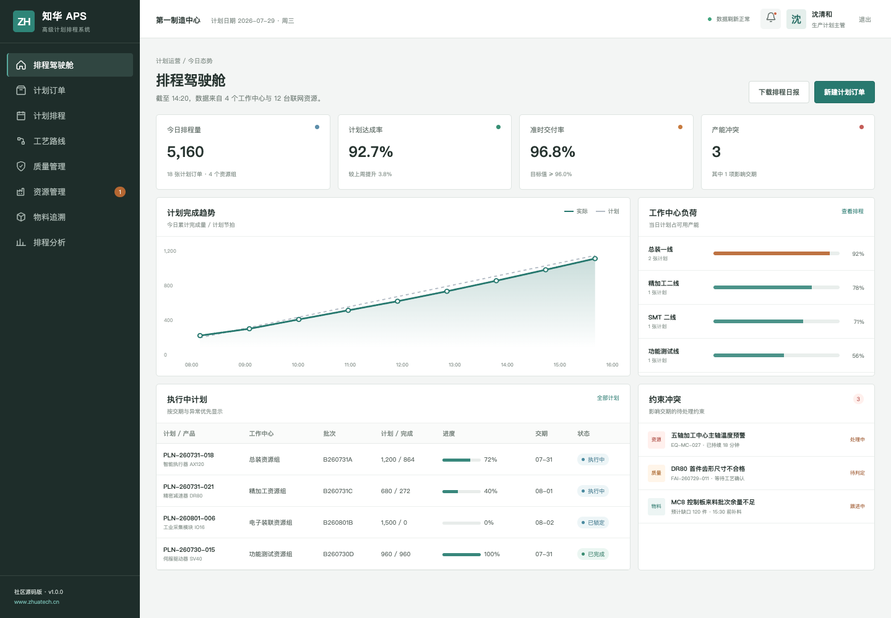
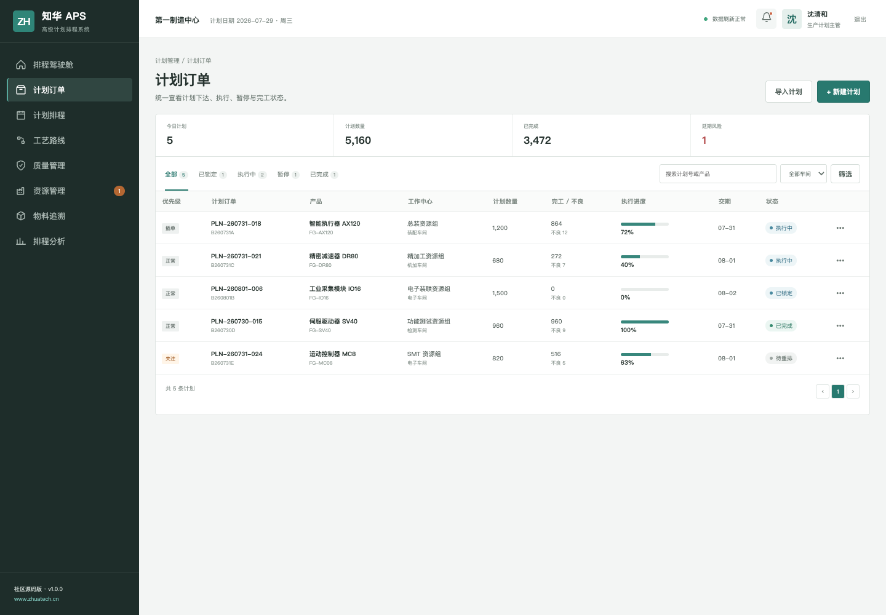
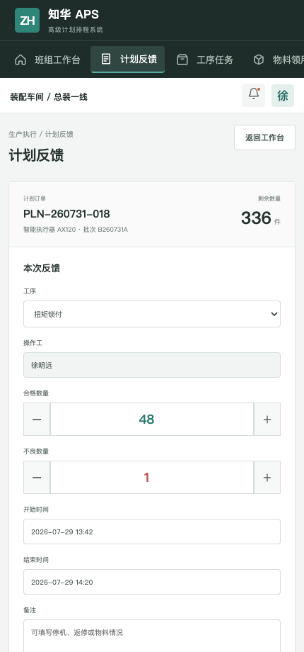

# ZhuaTech APS｜知华科技高级计划排程系统

> 面向离散制造企业的有限产能计划与排程社区源码版：把订单、物料、工艺、产能和交期放进同一张可执行计划。

[](backend/pom.xml) [](frontend/package.json) [](compose.yaml) [](LICENSE)

ZhuaTech APS 由 **知华科技（上海如静知华信息科技有限公司）** 研发并公开源代码，适用于个人学习高级计划排程、制造协同和 Java 前后端分离工程。知华科技官网：[https://www.zhuatech.cn/](https://www.zhuatech.cn/)。

## 排程现场

### 计划员看到的是约束，不只是甘特图



驾驶舱汇总今日排程量、计划达成率、准时交付率、产能冲突、资源负荷和约束异常，帮助计划员先处理真正影响交期的事项。

### 每张计划订单都有产能与物料依据



订单台账展示产品、批次、资源组、计划数量、完成反馈、交期、优先级与执行状态；演示数据包含插单、待重排和已锁定场景。

### 执行人员用 H5 反馈现场结果



现场端支持合格数、不良数、工时与备注反馈，并保留约束校验、异常呼叫和批次追溯的扩展位置。

## 计划闭环

```text
客户订单 / 预测
      ↓
需求合并 → 物料齐套 → 有限产能排程 → 计划锁定
                                    ↓
异常重排 ← 进度反馈 ← 班组执行 ← 计划下达
```

社区版包含：排程驾驶舱、计划订单、工作中心与资源负荷、约束校验、现场任务、计划反馈、异常协同、JWT 认证、MySQL/Flyway、Docker Compose 和演示模式。

## 工程技术

- 后端：Java 21、Spring Boot、Spring Security、Spring Data JPA、Flyway、MySQL 8
- 前端：Vue 3、Vue Router、Pinia、Axios、Vite，桌面管理端 + H5 执行端
- 工程包名：`cn.zhuatech.aps`
- 默认 API 前缀：`/api/aps`
- 数据库：`zhuatech_aps`

## 快速体验

```bash
cd frontend
npm install
npm run dev:demo
```

浏览器打开 `http://localhost:5173`。演示入口：计划管理端 `planner / Demo@2026`，现场协同端 `operator / Demo@2026`。

完整环境：

```bash
cp .env.example .env
# 修改数据库密码、Root 密码与 JWT_SECRET
docker compose up --build
```

## 二次开发方向

可继续扩展多工厂日历、换型矩阵、替代资源、替代料、瓶颈识别、插单模拟、冻结区、甘特拖排、排程求解器、ERP/MES/WMS/QMS 集成和消息通知。

## 使用许可

本工程仅允许个人用于非商业性的学习、研究和技术交流，**不得商用**。企业内部使用、生产部署、SaaS、客户交付、投标、收费培训、咨询实施或品牌替换均需提前获得上海如静知华信息科技有限公司书面授权，具体以 [LICENSE](LICENSE) 为准。

## 深度开发与授权

如需 APS 算法定制、制造系统集成、私有化部署或商业授权，请访问 [知华科技官网](https://www.zhuatech.cn/) 或扫码添加微信咨询：

| 微信咨询 1 | 微信咨询 2 |
| --- | --- |
|  |  |

## SEO 关键词

APS 开源、APS 源码、高级计划排程系统、有限产能排程、生产计划系统、制造排程软件、Java APS、Vue APS、知华科技、上海如静知华信息科技有限公司。

## 工作中心负荷平衡

新增 `POST /api/admin/capacity-balance`，扣除维护停机后计算有效产能，将计划工时与换型工时转换为负荷率和超负荷小时。系统会对急单锁定、批次合并和替代工作中心给出调度建议，超过 120% 时标记为 `CRITICAL`。
